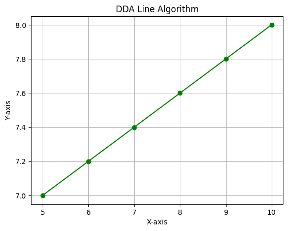

# Computer Graphics Algorithms

**Algorithms**
 
1. Digital Differential Analyzer (DDA)
2. Bresenham Line Drawing
3. MID Point Line Drawing 
4. MID Point Circle Drawing

 

**Outputs**
 

    

        
DDA

        
    

    

        
Bresenham's

        
    

    

        
MID Point Line

        
    

    

        
MID Point Circle

        
    

